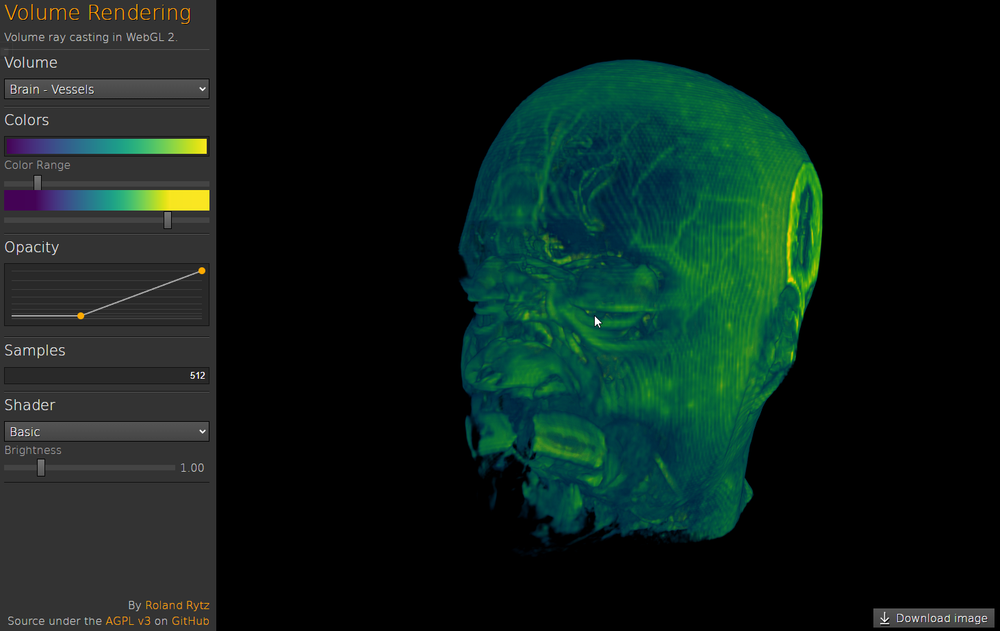

## 💎 basic 渲染过程

这个模式提供一个简单的 Volume rendering 效果，没有增加光照，如图所示



### verter shader

```c++
#version300 es

//* aspect 窗口比例 例如 16:9
//* var aspect = canvas.width / canvas.height;
uniform float aspect;
in vec2 coordinates;
out vec2 texCoord;

void main() {
    texCoord = coordinates;
    texCoord.x *= aspect;
    gl_Position =vec4(coordinates, 1.0, 1.0);
}
```

这里往像素着色器里面只输入2个三角形，并且调整了三角形的比例（整个窗口）
